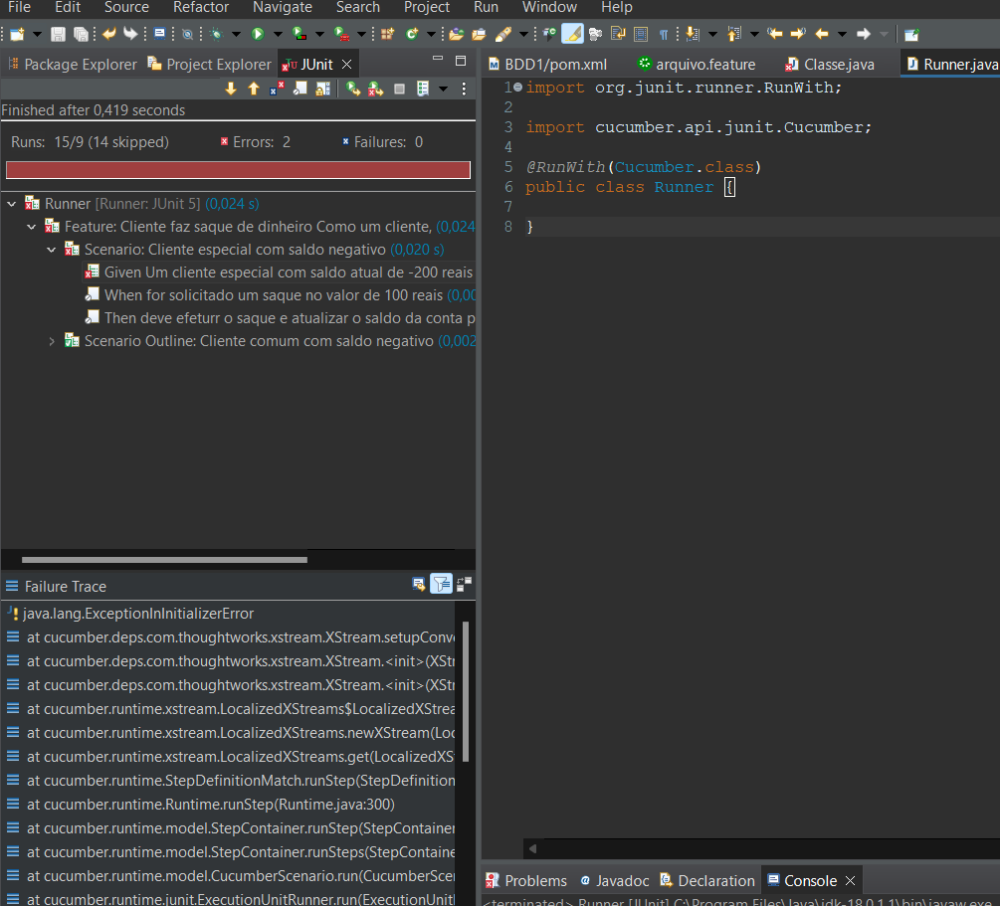

# Projeto de conta bancária 

## Descrição do projeto:
O projeto simula um sistema de saque de um caixa eletrônico com condições diferentes para contas Especiais e contas Comuns.

## Neste projeto eu utilizei:
- Java;
- Maven;
- Cucumber;
- JUnit.

## Cenários Cucumber
Cucumber gerado do projeto:

## Resultados no Testes JUnit
Após os testes finalizados:

## Última Atualização 01/12/2023
